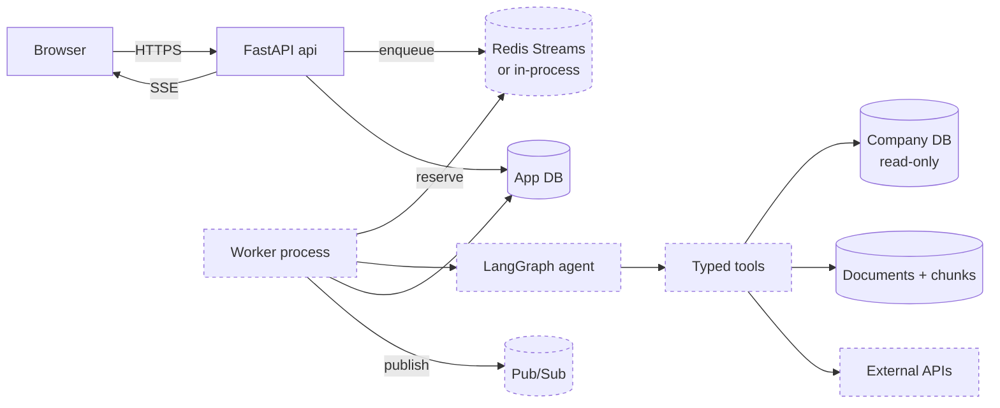

# Meridian

An autonomous research and analysis agent for business analysts. An analyst asks a multi-step
question, the agent plans the investigation, asks the user to approve the plan, executes it by
choosing tools, and writes a report in which every factual claim is cited to a tool result.

**Build status: partial but usable.** The web application, the guarded SQL path, citation
verification and the saved-run history work end to end. The durable worker, re-planning and
crash recovery are specified in [SPEC.md](SPEC.md) and tracked in [PLAN.md](PLAN.md) but not
built. The table below is an honest accounting; nothing in this README describes code that does
not exist, and every figure came from a command that was run.

## What is implemented

| Area | Status | Where |
| --- | --- | --- |
| Web application: landing, sign-in, workspace, 7 pages | Done | [web/](web/) |
| Ask a question, get a verified cited answer | Done | [app/services/research_service.py](app/services/research_service.py) |
| Read-only SQL guard, by parsing | Done | [app/domain/sql_guard.py](app/domain/sql_guard.py) |
| Citation verification against returned rows | Done | [app/domain/citations.py](app/domain/citations.py) |
| Saved runs, history, share links | Done | [app/services/run_service.py](app/services/run_service.py) |
| Security evaluation suite, executed live | Done | [app/services/evaluation_service.py](app/services/evaluation_service.py) |
| Document ingest, chunking, injection screening | Done | [app/services/document_service.py](app/services/document_service.py) |
| Argon2 + JWT auth, RBAC | Done | [app/services/auth_service.py](app/services/auth_service.py) |
| Any OpenAI-compatible model (OpenAI, Groq, Ollama) | Done | [app/adapters/chat/openai_chat.py](app/adapters/chat/openai_chat.py) |
| Export: Markdown download, PDF via print | Done | [web/assets/export.js](web/assets/export.js) |
| Command palette, guided tour | Done | [web/assets/palette.js](web/assets/palette.js) |
| Budgets, error taxonomy, port protocols | Done | [app/domain/](app/domain/) |
| 14-table schema with justified indexes | Done | [app/infra/models.py](app/infra/models.py) |
| Company data with three planted stories | Done | [company_db/generate.py](company_db/generate.py) |
| LangGraph agent graph | Not built | Phase 3 of [PLAN.md](PLAN.md) |
| Worker, queue, durable resume | Not built | Phase 4 |
| Re-planning when evidence contradicts the plan | Not built | Phase 3 |
| Live streaming (SSE) while a run is in progress | Not built | Phase 4 |
| Docker, CI | Not built | Phase 9 |

The research pipeline is a single pass -- plan, query, write, verify -- rather than the
LangGraph loop the specification describes. The guardrails that make it safe are real; the
orchestration around them is simpler than planned.

## Verified state

Every number below came from running the command shown, on Windows 11 with Python 3.14.8.

```
.	asks.ps1 test        173 passed
                        92% coverage on app/domain and app/services
.	asks.ps1 lint        All checks passed (ruff format + ruff check)
.	asks.ps1 typecheck   Success: no issues found in 72 source files (mypy --strict)
.	asks.ps1 seed        regions 3, countries 13, products 10, customers 22,
                        orders 4491, order_items 7510, marketing_spend 132,
                        documents 12 (1 flagged for injection), chunks 18
security suite          22/22 scenarios pass: 17/17 attacks blocked,
                        5/5 legitimate inputs allowed
```

## Quick start

Requires Windows with PowerShell, Python 3.13 or newer, and Node 20 or newer.

```powershell
.\tasks.ps1 setup
copy .env.example .env
.\tasks.ps1 seed
.\tasks.ps1 test
```

The defaults run entirely offline: no API key, no network access, no model download.

Then start it:

```powershell
.venv\Scripts\python.exe -m uvicorn app.main:app --factory --port 8080
```

Open <http://localhost:8080>. The developer API is at `/api/docs`, deliberately unlinked from
the site navigation.

To ask free-form questions rather than the built-in ones, point it at any OpenAI-compatible
provider and restart:

```
LLM_PROVIDER=openai
OPENAI_BASE_URL=https://api.groq.com/openai/v1
OPENAI_API_KEY=gsk_...
OPENAI_MODEL=openai/gpt-oss-120b
```

Ollama works the same way with `OPENAI_BASE_URL=http://localhost:11434/v1` and no key, which
keeps every question on your own machine.

Demo accounts created by the seed, all with password `demo-password`:

| Email | Role |
| --- | --- |
| admin@meridian.demo | admin |
| analyst@meridian.demo | analyst |
| viewer@meridian.demo | viewer |

## Architecture



Dashed components are specified but not yet implemented.

The dependency rule is that `app/domain` imports nothing from the rest of the application.
Decision logic lives there as pure functions, which is why the SQL guard, budget and citation
tests need no database, no network and no event loop. Vendor SDKs are imported only under
`app/adapters/`, and everything is wired in one composition root,
[app/container.py](app/container.py).

## Design decisions

**Read-only SQL by parsing, not pattern matching.** A regex cannot distinguish a CTE named
`delete_me`, the string literal `'DROP TABLE orders'`, or a column named `update_ts` from an
actual mutation. [app/domain/sql_guard.py](app/domain/sql_guard.py) parses with sqlglot and
reasons about the syntax tree. It dispatches on `exp.Query`, which also fixed a real bug: an
earlier version enumerated `Select | Union` by hand and so refused `INTERSECT` and `EXCEPT`,
which are read-only and legitimate. Defence is layered: the company database is also opened with
`PRAGMA query_only` on a separate engine, because a parser is software too.

**Citations are verified against the numbers, not just the identifiers.** The realistic failure
is not an invented `[S9]`; it is a true source id attached to a figure the model rounded wrongly
or made up. [app/domain/citations.py](app/domain/citations.py) extracts the numeric claims from
each sentence and matches them against the cited observation's rows, tolerating rounding and
unit changes.

**Budgets are hard, and unpriced models are not free.** Steps, tokens, cost and wall time are all
capped, because a cap on steps alone is useless when one step can call a tool fifty times. A
model missing from the price table is costed at a fallback rate rather than zero, so an unpriced
model cannot slip past the cost cap.

**Ports as `typing.Protocol`, not ABCs.** Adapters inherit nothing and the dependency arrow
points inward. Every port has a real implementation and a deterministic offline one, which is
what lets the whole suite run with no network and no API key.

**Hash embeddings by default.** The target environment blocks some hosts and cannot rely on a
model download. Feature hashing needs neither. It captures lexical overlap rather than meaning,
which is why hybrid search fuses it with BM25 instead of trusting vectors alone.

## Known trade-offs

- Chunk embeddings are stored as JSON arrays and scored in Python. Fine at this corpus size, and
  wrong above roughly ten thousand chunks, where a real vector index is needed.
- The in-process queue, cache and rate limiter are per-process, so running several API workers
  multiplies the effective rate limit. Redis is the fix and is already wired.
- JWTs are stateless, so a token stays valid until it expires. There is no revocation list.
- The fixed-window rate limiter admits up to twice the limit across a window boundary. It exists
  to stop runaway clients, not to meter a paid quota.
- Numeric citation checking compares magnitudes, so it cannot catch a reversed direction
  ("revenue grew 7.1%" against a stored `-7.1`). That is what the model review step is for.

## Sample data

`python -m scripts.seed_demo` is idempotent and generates two years of data for a fictional
"Northwind Analytics" containing three deliberate stories, so the agent has something real to
find. Figures below are from the current seed.

**1. EMEA Q3 2025 revenue decline.** Local list prices are fixed at each year's reference rate
and not re-based intra-year, so USD revenue moves with the spot rate while local-currency revenue
does not.

| Quarter | USD | Local currency |
| --- | --- | --- |
| 2025 Q2 | 9,468,359 | 8,471,109 |
| 2025 Q3 | 8,926,124 | 8,657,151 |

USD fell 5.7% while local-currency revenue rose 2.2%, so currency accounts for 7.9 points of the
decline. One account (Helvetica Logistics, 9.5% of EMEA Q2 revenue) churned at the end of Q2. An
agent that reads only `subtotal_usd` concludes demand collapsed; one that compares local with USD
finds the real answer.

**2. Growth and margin disagree.** Edge Telemetry grew 100% year on year at a 22% gross margin,
against platform lines growing 16 to 28% at 64 to 68%.

**3. A poor-ROI campaign.** EMEA's "Quantum Leap" returns 0.41x its spend; the other five
campaigns return 2.8x to 4.5x.

Twelve internal documents partly explain these stories. One, "Vendor Integration Notes
(Imported)", contains a realistic prompt-injection attempt. Ingest flags it with eight distinct
signatures and no false positives across the other eleven.

## What I would change at scale

**At 10x.** Move the queue to Redis Streams with a dead-letter stream and move checkpoints to
PostgreSQL. Replace JSON-array embeddings with pgvector. Split the SSE fan-out behind a dedicated
pub/sub so API processes stay stateless. Add a per-tenant cost ledger, since budgets are currently
per run and an abusive tenant can still run many cheap runs.

**At 100x.** Partition runs and observations by time and drop old partitions rather than deleting
rows. Checkpoint growth becomes the dominant storage cost, so checkpoints need compaction and a
retention window. Tool execution becomes its own service with per-tool concurrency limits and
circuit breakers shared across workers, since a shared upstream rate limit cannot be respected by
processes that each hold a private breaker.

## Repository layout

```
app/
  domain/      pure decision logic and port protocols, no I/O
  adapters/    the only place vendor SDKs are imported
  services/    orchestration and transactions
  api/         FastAPI routes, middleware, error handlers
  infra/       database, ORM, logging
  agent/       LangGraph graph and nodes (not built)
  tools/       typed agent tools (not built)
  worker/      queue consumer (not built)
company_db/    the read-only sample company schema and its generator
scripts/       seed_demo, and others listed in PLAN.md
tests/         unit and integration, fully offline
```

## Licence

MIT. See [LICENSE](LICENSE).
